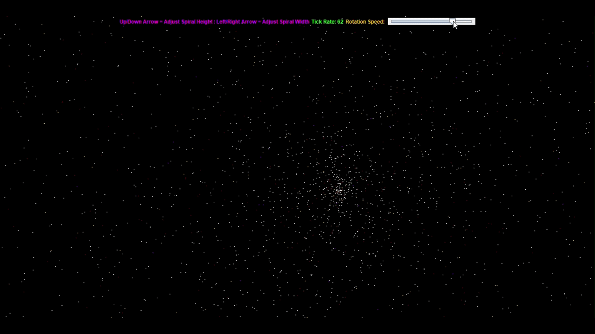
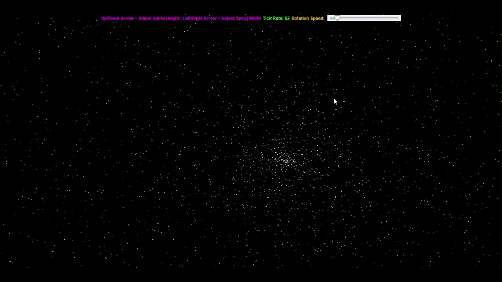

# Spiral Galaxy

## Description

This project is a very simple simulation/animation of a disc shaped galaxy, like the one we live in.

## Features

- Slider adjusts the rotational speed of the galaxy
- The up arrow key and down arrow key adjusts the height of the galaxy
- The left arrow key and right arrow key adjusts the width of the galaxy

## Demo

The rotational speed of the galaxy can be changed by moving he slider.

The resolution of the galaxy can be changed with the arrow keys.

## Building

Clone the repository:

    git clone https:
    cd fol

Build the project on Windows:

    gradlew.bat build
